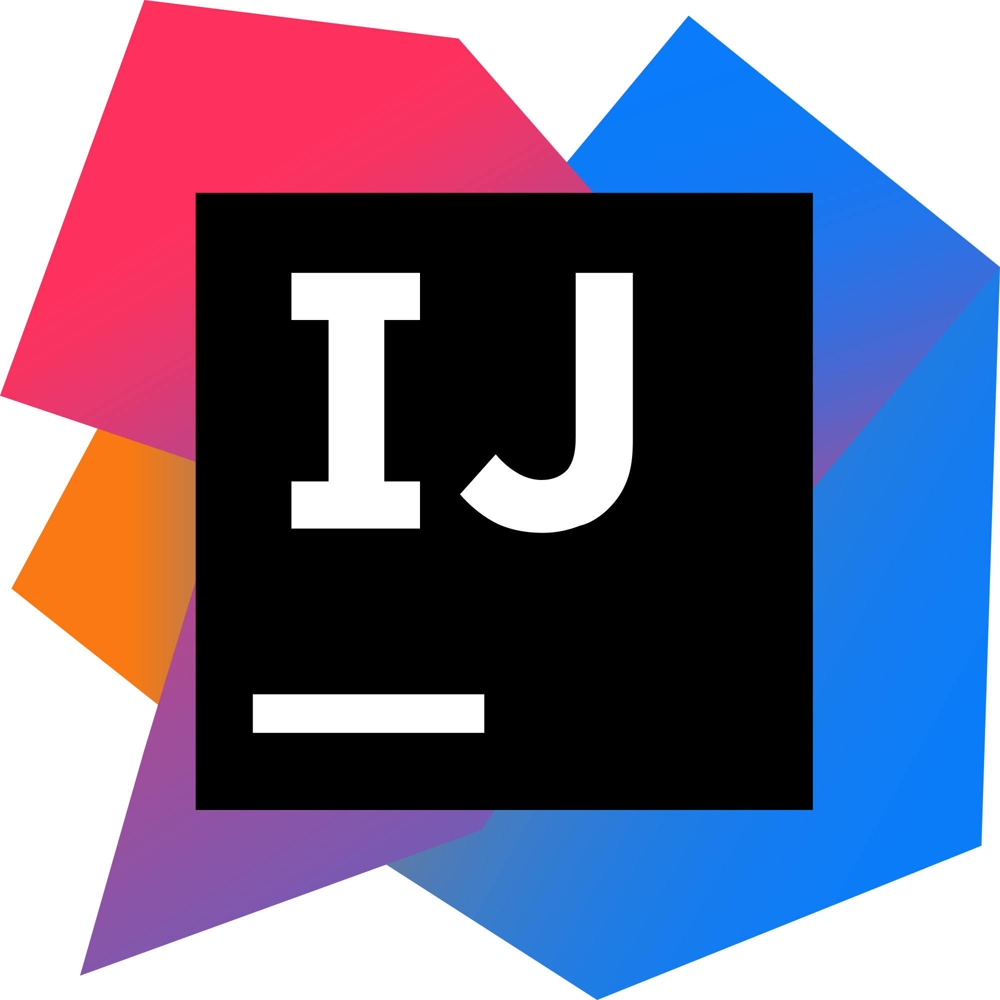
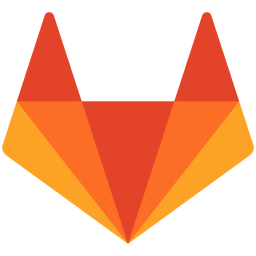

[][website]

# Hi, I'm a student in Computer Science @HHN

- working for [@pace](https://github.com/pace?type=source) in the backend/golang team 
- learning Go
- learning Java
- working on open source projects
- highly insterested in SmartHome solutions
- passion for building SmartHome devices

## Currently working on:

<h2 align="center">🛠 Tools                                                                                                                                  Languages</h2>

 
 

<h2 align="center">Social Media</h2>

[website]: https://florianbenediktaust.com
[twitter]: https://twitter.com/FLorianBAust
[instagram]: https://www.instagram.com/florian.benedikt.aust/
[linkedin]: https://www.linkedin.com/in/florian-aust-b598951ba/
